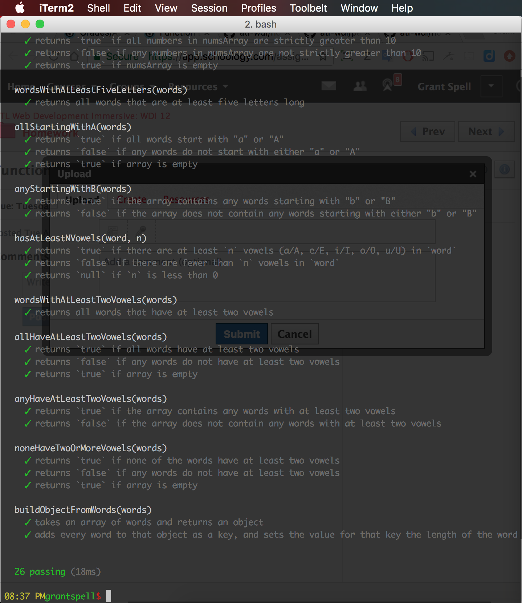

<!-- ## Submitting Your Work

When you're ready to submit your work,

1.  Run the command `npm test` and take a screenshot of the output in your
    terminal.
2.  Push your code to your fork of the class repo.-->
3.  File an issue on the class repo titled "Your Name -- w01d04".
    
    !! This is where I first submitted my homework on 09.05.17 !!
    !! and I didn't post to Schoology because the original     !!
    !! README.md didn't say to submit to Schoology even though !!
    !! I should assumed to. Sorry!                             !!

<!--
The issue should include:

-   A link that points back to your fork.
-->
-   The screenshot you took.

    
<!--
-   A 'comfort' score on how you feel about the material, from 1 (very
    uncomfortable) to 5 (very comfortable) -->